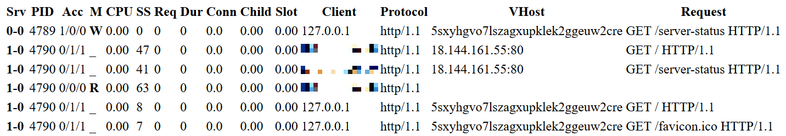
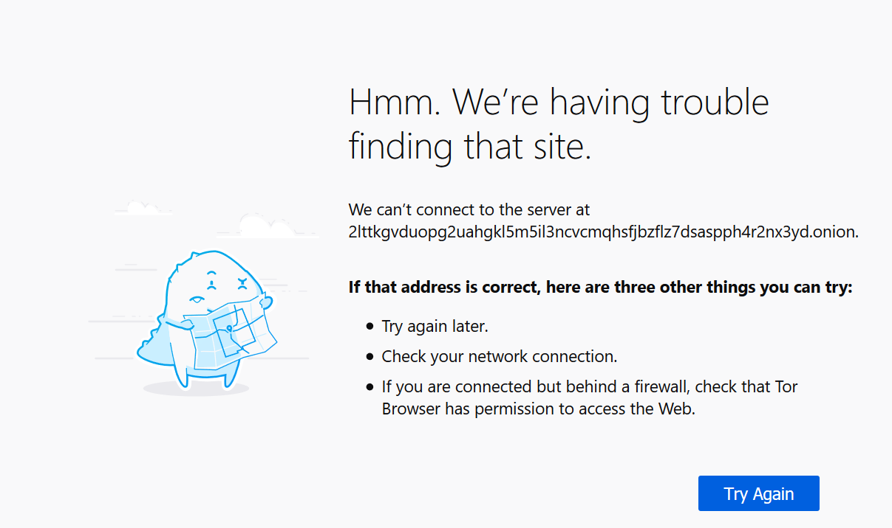

# tor-sauce


A repository used for studying security related topics that deal with Tor (anonymity network).

# Usage

* [Apache mod_status Leak](#apache-mod_status-leak)
  * [Deploy EC2 Ubuntu Instance](#deploy-ec2-ubuntu-instance)
  * [Demo the Vulnerability (AWS)](#demo-the-vulnerability-aws)
  * [Patch the Vulnerability (AWS)](#patch-the-vulnerability-aws)
  * [Teardown Terraform AWS Instance](#teardown-terraform-aws-instance)
  * [Deploy Vagrant Ubuntu VM](#deploy-vagrant-ubuntu-vm)
  * [Demo the Vulnerability (Vagrant)](#demo-the-vulnerability-vagrant)
  * [Patch the Vulnerability (Vagrant)](#patch-the-vulnerability-vagrant)
  * [Teardown Vagrant](#cleanup-vagrant)
* [Configuring an Authenticated Onion Service](#configuring-an-authenticated-onion-service)


## Apache mod_status Leak

If the Onion service runs an Apache HTTP server, check for a page generated by
the mod_status module. By default, if enabled, this page will be published at
the **/server-status** path on the Web server. Simply by visiting
http://host.onion/server-status may reveal the server's clearnet IP address,
along with other information.

### Deploy EC2 Ubuntu Instance

The Vagrant deployment has some pitfalls when demonstrating the vulnerability.
You would have to expose your router, in order to trully expose the clearnet
site. To circumvent this issue, I have included terraform configuration files
to deploy an **EC2 instance** running Ubuntu.

Initialize the modules, backend, and provider plugins.

```
$ cd mod_status_leak/terraform
$ terraform init

Initializing the backend...

Initializing provider plugins...
- Checking for available provider plugins...
- Downloading plugin for provider "aws" (hashicorp/aws) 2.58.0...
```

Generate SSH key, by default Terraform will look for the private key in the
Terraform working directory. You can add your own existing private key by
modifying the default value of private_key in 
**mod_status_leak/terraform/vars.tf** file.

```
$ ssh-keygen -f id_rsa

Generating public/private rsa key pair.
Enter passphrase (empty for no passphrase):
Enter same passphrase again:
Your identification has been saved in id_rsa.
Your public key has been saved in id_rsa.pub.
The key fingerprint is:
SHA256:oOo0ZOgO0nRELpuPSyi/f5nPvKQWqHji/7bt6nUHp48 massimo@laptop-asus
The key's randomart image is:
+---[RSA 2048]----+
|    .            |
|   o             |
|  . o .          |
| . = . .         |
|. * o.  S. .     |
|.* =. .   +      |
|=oB..  =.o .     |
|B=oo .B=. +      |
|.=*+=B=+=E .     |
+----[SHA256]-----+
```

Make sure you specify the public key as an input variable in the
**terraform.tfvars** file.

```
$ cat terraform.tfvars

public_key = "ssh-rsa AAAAB3NzaC1yc2EAAAADAQABAAABAQDdw0A1JBVxDByuHnHbn8+p5iVLSXxzH3pRiY8lenNe9uesExjQdxyL/C4r8QAxpijC+MzRAHgQMdEGfKZM6i5XAQ9kILh6KTrYZ8D8ZbayoYYirTc2Flvpd/gDIy2AYElwBuwCs5dNKUUqdU4gLwb7cc2YHdyhtXDst6k3IkOctRDpkVtQ5uSsb+lR5Y/BR3k6hP+Pn6kttf3rJe9QmZSOnRvcs470KNZK+VSalwXnCKmNg1hz4k/wArXVhcqtJBkBl0zeD1JIIdH8ZxOs1ZffznvVKDoAdZ9pEYxg+OYvrU5j/akaUogBJBmL+npFMwOq3HaR0ypfxRugAn3J8q/j massimo@mr-robot"
```

Deploy EC2 Ubuntu instance.

```
$ terraform apply

Plan: 5 to add, 0 to change, 0 to destroy.

Do you want to perform these actions?
  Terraform will perform the actions described above.
  Only 'yes' will be accepted to approve.

  Enter a value: yes

Apply complete! Resources: 5 added, 0 changed, 0 destroyed.

Outputs:

public_ip = 18.144.161.55
```

Once the deployment is done, you will receive an IP address. Connect to the
provisioned EC2 instance by using SSH. Make sure you accept the unknown host
fingerprint. This is normal when connecting for the first time.

```
$ ssh -i id_rsa ubuntu@18.144.161.55

The authenticity of host '18.144.161.55 (18.144.161.55)' can't be established.
ECDSA key fingerprint is SHA256:xpzaU0Odg0dUq22IOjaxylk7rT/atrQ+IhpuN1m+NxE.
Are you sure you want to continue connecting (yes/no)? yes
Warning: Permanently added '18.144.161.55' (ECDSA) to the list of known hosts.
```

### Demo the Vulnerability (AWS)

The virtual machine contains a hosted hidden service using the Tor anonymity
network. Also to demonstrate the vulnerability, a normal service is hosted on
port 80. The mod_status leak will show you what services are being hosted on
the server. By exposing the regular service, you will be able to fetch the real
IP address of the server.

Test that the clearnet service is up and running from outside the EC2 instance.
You should receive a response from Apache.

```
$ curl 18.144.161.55
Welcome to the clearnet
```
Fetch the onion address that was generated from Tor.

```
ubuntu@ip-172-31-6-113:~$ sudo cat /var/lib/tor/hidden_service/hostname
5sxyhgvo7lszagxupklek2ggeuw2creydxmyt4jdk35ksfwyy7olyjad.onion
```

Download the Tor Browser and visit the server-status page hosted on the hidden
service.

```
5sxyhgvo7lszagxupklek2ggeuw2creydxmyt4jdk35ksfwyy7olyjad.onion/server-status
```

As you can see, the clearnet service is exposed. The VHost for the clearnet
shows the actual IP address of the server. This is not always the case, you
will most likely encounter a domain name. An attacker could resolve the
IP address of the domain name and fetch the real identity of the hidden
service. Also you can use a fake domain name, **mr-robot.bounceme.net**.
You could technically set up a honeypot on purpose to catch hackers.



### Patch the Vulnerability (AWS)

In default Apache configuration, the server sends HTTP Header with the
information of Apache version, modules, Operating System, etc of the Server.
The HTTP response header **Server** displays all these details of the server.
This information can be used by hackers to try to exploit any vulnerabilities
in the Apache, OS or other modules you are running, specially if you are
running an older version with known vulnerabilities.

There is an easy way to hide the apache version and other server information
from the HTTP headers. By setting the **ServerTokens** and **ServerSignature**
variables in your httpd.conf file the server information would not longer be
added to the HTTP headers.

```
ubuntu@ip-172-31-6-113:~$ sudo sed \
  --in-place 's/ServerTokens OS/ServerTokens Prod/' \
  /etc/apache2/conf-enabled/security.conf

ubuntu@ip-172-31-6-113:~$ sudo sed \
  --in-place 's/ServerSignature On/ServerSignature Off/' \
  /etc/apache2/conf-enabled/security.conf
```

Disable Apache's mod_status module to turn off status information.

```
ubuntu@ip-172-31-6-113:~$ sudo a2dismod status
ubuntu@ip-172-31-6-113:~$ sudo service apache2 restart
```

Using curl, attempt to hit the server-status page.

```
ubuntu@ip-172-31-6-113:~$ curl --silent \
  --socks5-hostname localhost:9050 \
  5sxyhgvo7lszagxupklek2ggeuw2creydxmyt4jdk35ksfwyy7olyjad.onion/server-status

<!DOCTYPE HTML PUBLIC "-//IETF//DTD HTML 2.0//EN">
<html><head>
<title>404 Not Found</title>
</head><body>
<h1>Not Found</h1>
<p>The requested URL was not found on this server.</p>
</body></html>
```

As you can see, the vulnerability has been patched. A lesson learned from this
is that you should never trust the default configuration. By default the status
module is enable for sysadmins to monitor Apache. This configuration setting is
not secure.

### Teardown Terraform AWS Instance

After you are done with the Ubuntu EC2 instance, make sure to teardown the
instance using Terraform.

```
$ terraform destroy

Plan: 0 to add, 0 to change, 5 to destroy.

Do you really want to destroy all resources?
  Terraform will destroy all your managed infrastructure, as shown above.
  There is no undo. Only 'yes' will be accepted to confirm.

  Enter a value: yes

aws_instance.ec2_server: Destroying... [id=i-0be790084b895b127]
aws_instance.ec2_server: Still destroying... [id=i-0be790084b895b127, 10s elapsed]
aws_instance.ec2_server: Still destroying... [id=i-0be790084b895b127, 20s elapsed]
aws_instance.ec2_server: Still destroying... [id=i-0be790084b895b127, 30s elapsed]
aws_instance.ec2_server: Destruction complete after 31s
aws_security_group.egress_sg: Destroying... [id=sg-055bf00aea29e1294]
aws_security_group.ssh_sg: Destroying... [id=sg-09c13c33441469b85]
aws_key_pair.ssh_key: Destroying... [id=tor_sauce]
aws_security_group.http_sg: Destroying... [id=sg-0c21df247c70028df]
aws_key_pair.ssh_key: Destruction complete after 0s
aws_security_group.ssh_sg: Destruction complete after 0s
aws_security_group.http_sg: Destruction complete after 0s
aws_security_group.egress_sg: Destruction complete after 0s

Destroy complete! Resources: 5 destroyed.
```

### Deploy Vagrant Ubuntu VM

In order to demonstrate the vulnerability, I have created a Vagrantfile to
provision a virtual machine with the vulnerability installed.

Vagrant is a tool for building and managing virtual machine environments in a
single workflow. With an easy-to-use workflow and focus on automation, Vagrant
lowers development environment setup time, increases production parity, and
makes the "works on my machine" excuse a relic of the past.

Install the vagrant-vbguest plugin.

```
$ vagrant plugin install vagrant-vbguest
```

Provision the Ubuntu Tor virtual machine using Vagrant.

```
$ cd mod_status_leak
$ vagrant up
```

Wait for the machine to be provisioned, it might take up to ten minutes.
Connect to the provisioned virtual machine by using SSH.

```
$ vagrant ssh
```

### Demo the Vulnerability (Vagrant)

The virtual machine contains a hosted hidden service using the Tor anonymity
network. Also to demonstrate the vulnerability, a normal service is hosted on
port 80. The mod_status leak will show you what services are being hosted on
the server. By exposing the regular service, you will be able to fetch the real
IP address of the server.

Fetch the onion address that was generated from Tor.

```
vagrant@ubuntu-tor:~$ sudo cat /var/lib/tor/hidden_service/hostname
75ql3vcsofbbt7gvdccgqydz7vhwcgzktcxbhpsrtqv2z6auxldjfdyd.onion
```

Test that the clearnet service is up and running. You should receive a response
from Apache.

```
vagrant@ubuntu-tor:~$ curl localhost
Welcome to the clearnet
```

Using curl, execute a Tor request by specifying a **SOCKS5** proxy. We can use
the lynx browser to render out the output from curl. This makes it easier to
view the exposed information.

```
vagrant@ubuntu-tor:~$ curl --silent \
  --socks5-hostname localhost:9050 \
  75ql3vcsofbbt7gvdccgqydz7vhwcgzktcxbhpsrtqv2z6auxldjfdyd.onion/server-status | \
  lynx --stdin
```

As you can see, the clearnet service is exposed. An attacker could resolve the
IP address of the domain name and fetch the real identity of the hidden
service. For this example I used a fake domain name, **mr-robot.bounceme.net**.
You could technically set up a honeypot on purpose to catch hackers.


### Patch the Vulnerability (Vagrant)

In default Apache configuration, the server sends HTTP Header with the
information of Apache version, modules, Operating System, etc of the Server.
The HTTP response header **Server** displays all these details of the server.
This information can be used by hackers to try to exploit any vulnerabilities
in the Apache, OS or other modules you are running, specially if you are
running an older version with known vulnerabilities.

There is an easy way to hide the apache version and other server information
from the HTTP headers. By setting the **ServerTokens** and **ServerSignature**
variables in your httpd.conf file the server information would not longer be
added to the HTTP headers.

```
vagrant@ubuntu-tor:~$ sudo sed \
  --in-place 's/ServerTokens OS/ServerTokens Prod/' \
  /etc/apache2/conf-enabled/security.conf

vagrant@ubuntu-tor:~$ sudo sed \
  --in-place 's/ServerSignature On/ServerSignature Off/' \
  /etc/apache2/conf-enabled/security.conf
```

Disable Apache's mod_status module to turn off status information.

```
vagrant@ubuntu-tor:~$ sudo a2dismod status
vagrant@ubuntu-tor:~$ sudo service apache2 restart
```

Using curl, attempt to hit the server-status page.

```
vagrant@ubuntu-tor:~$ curl --silent \
  --socks5-hostname localhost:9050 \
  75ql3vcsofbbt7gvdccgqydz7vhwcgzktcxbhpsrtqv2z6auxldjfdyd.onion/server-status

<!DOCTYPE HTML PUBLIC "-//IETF//DTD HTML 2.0//EN">
<html><head>
<title>404 Not Found</title>
</head><body>
<h1>Not Found</h1>
<p>The requested URL was not found on this server.</p>
</body></html>
```

As you can see, the vulnerability has been patched. A lesson learned from this
is that you should never trust the default configuration. By default the status
module is enable for sysadmins to monitor Apache. This configuration setting is
not secure.

### Teardown Vagrant

After you are done with the virtual machine, make sure to cleanup the
environment.

```
vagrant@ubuntu-tor:~$ exit
logout
Connection to 127.0.0.1 closed.

$ vagrant destroy
    tor: Are you sure you want to destroy the 'tor' VM? [y/N] y
==> tor: Forcing shutdown of VM...
==> tor: Destroying VM and associated drives...
```

You might also want to delete the Ubuntu Vagrant Box, if not needed. That will
freeup roughly 486MB of space.

```
$ vagrant box list
$ vagrant box remove ubuntu/eoan64
```

## Configuring an Authenticated Onion Service

An authenticated Onion service is a certain kind of Tor hidden service that
requires clients to supply an authentication token (basically, a password)
before responding to incoming connection requests. There are two different,
compatible Onion service versions that support client authentication:
version 2, and version 3. I will cover version 3 due to being the latest
version being used.

Generate Tor version 3 Onion service keys.

```
$ openssl genpkey -algorithm x25519 -out /tmp/private-key.pem

$ encoded_priv_key=$(
    cat /tmp/private-key.pem | \
      grep --invert-match " PRIVATE KEY" | \
      base64pem --decode | \
      tail --bytes=32 | \
      base32 | \
      sed 's/=//g'
  )

$ encoded_pub_key=$(
    openssl pkey -in /tmp/private-key.pem -pubout | \
      grep --invert-match " PUBLIC KEY" | \
      base64pem --decode | \
      tail --bytes=32 | \
      base32 | \
      sed 's/=//g'
  )

$ echo "descriptor:x25519:$encoded_pub_key" | sudo tee --append \
    /var/lib/tor/hidden_service/authorized_clients/mr-robot.auth

$ systemctl restart tor
```

Attempt to connect to the Onion service using Tor browser or curl. You should
receive an error message that the browser was unable to connect to the server.



Close the Tor browser and configure the Tor browser to use a private key to
authenticate with the specified onion service.

Add **ClientOnionAuthDir** to the **torrc** configuration file. Makre sure to
specify the path where you installed the Tor browser. In Windows I have
installed it under **C:\Tor Browser**.

The torrc configuration file is located under
**C:\Tor Browser\Browser\TorBrowser\Data\Tor** directory.

```
ClientOnionAuthDir C:\Tor Browser\Browser\TorBrowser\Data\Tor\authorized_clients
```

Add the private key that was generated earlier to **random_name.auth_private**
file under the **authorized_clients** folder on the client side. Replace
random_name with a name of your choosing.

```
$ onion_address=$(sudo cat /var/lib/tor/hidden_service/hostname)
$ echo "${onion_address%.onion}:descriptor:x25519:$encoded_priv_key"

2lttkgvduopg2uahgkl5m5il3ncvcmqhsfjbzflz7dsaspph4r2nx3yd:descriptor:x25519:SAAPQSQZEEIYN7BN6A3H3TUMKHKIUQLM2OF4XLB3KVIMBHC72NIA
```

Restart the Tor browser and attempt to connect to the Onion service. This time
you should be able to see the service responding back.

# Acknowledgments

[AnarchoTechNYC](https://github.com/AnarchoTechNYC/CTF/wiki/Tor#de-anonymization-attacks)

[Apache ServerTokens and ServerSignature](https://www.virendrachandak.com/techtalk/how-to-hide-apache-information-with-servertokens-and-serversignature-directives/)

[Configuring a Tor Hidden Service](https://famicoman.com/2018/01/05/configuring-a-tor-hidden-service/)

[How to Host a Site on the Dark Web](https://medium.com/@jasonrigden/how-to-host-a-site-on-the-dark-web-38edf00996bf)

[Tor Support](https://support.torproject.org/apt/tor-deb-repo/)

[Vagrant Documentation](https://www.vagrantup.com/docs/)