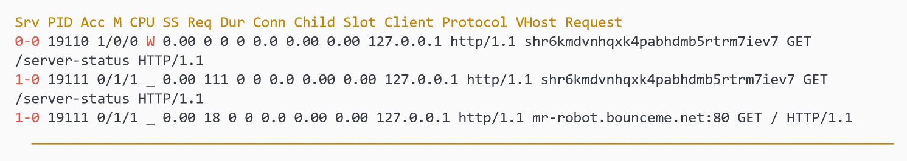

# tor-sauce


A repository used for studying security related topics that deal with Tor (anonymity network).

# Usage

* [Apache mod_status Leak](#apache-mod_status-leak)
  * [Deploy Ubuntu VM with Tor Installed](#deploy-ubuntu-vm-with-tor-installed)
  * [Demo the Vulnerability](#demo-the-vulnerability)
  * [Fix the Vulnerability](#fix-the-vulnerability)
  * [Cleanup Vagrant](#cleanup-vagrant)


## Apache mod_status Leak

If the Onion service runs an Apache HTTP server, check for a page generated by
the mod_status module. By default, if enabled, this page will be published at
the **/server-status** path on the Web server. Simply by visiting
http://host.onion/server-status may reveal the server's clearnet IP address,
along with other information.

### Deploy Ubuntu VM with Tor Installed

In order to demonstrate the vulnerability, I have created a Vagrantfile to
provision a virtual machine with the vulnerability installed.

Vagrant is a tool for building and managing virtual machine environments in a
single workflow. With an easy-to-use workflow and focus on automation, Vagrant
lowers development environment setup time, increases production parity, and
makes the "works on my machine" excuse a relic of the past.

Install the vagrant-vbguest plugin.

```
$ vagrant plugin install vagrant-vbguest
```

Provision the Ubuntu Tor virtual machine using Vagrant.

```
$ cd mod_status_leak
$ vagrant up
```

Wait for the machine to be provisioned, it might take up to ten minutes.
Connect to the provisioned virtual machine by using SSH.

```
$ vagrant ssh
```

### Demo the Vulnerability

The virtual machine contains a hosted hidden service using the Tor anonymity
network. Also to demonstrate the vulnerability, a normal service is hosted on
port 80. The mod_status leak will show you what services are being hosted on
the server. By exposing the regular service, you will be able to fetch the real
IP address of the server.

Fetch the onion address that was generated from Tor.

```
vagrant@ubuntu-tor:~$ sudo cat /var/lib/tor/hidden_service/hostname
75ql3vcsofbbt7gvdccgqydz7vhwcgzktcxbhpsrtqv2z6auxldjfdyd.onion
```

Test that the clearnet service is up and running. You should receive a response
from Apache.

```
vagrant@ubuntu-tor:~$ curl localhost
Welcome to the clearnet
```

Using curl, execute a Tor request by specifying a **SOCKS5** proxy. We can use
the lynx browser to render out the output from curl. This makes it easier to
view the exposed information.

```
vagrant@ubuntu-tor:~$ curl --silent \
  --socks5-hostname localhost:9050 \
  75ql3vcsofbbt7gvdccgqydz7vhwcgzktcxbhpsrtqv2z6auxldjfdyd.onion/server-status | \
  lynx --stdin
```



As you can see, the clearnet service is exposed. An attacker could resolve the
IP address of the domain name and fetch the real identity of the hidden
service.

### Fix the Vulnerability

In default Apache configuration, the server sends HTTP Header with the
information of Apache version, modules, Operating System, etc of the Server.
The HTTP response header **Server** displays all these details of the server.
This information can be used by hackers to try to exploit any vulnerabilities
in the Apache, OS or other modules you are running, specially if you are
running an older version with known vulnerabilities.

There is an easy way to hide the apache version and other server information
from the HTTP headers. By setting the **ServerTokens** and **ServerSignature**
variables in your httpd.conf file the server information would not longer be
added to the HTTP headers.

```
vagrant@ubuntu-tor:~$ sudo sed \
  --in-place 's/ServerTokens OS/ServerTokens Prod/' \
  /etc/apache2/conf-enabled/security.conf

vagrant@ubuntu-tor:~$ sudo sed \
  --in-place 's/ServerSignature On/ServerSignature Off/' \
  /etc/apache2/conf-enabled/security.conf
```

Disable Apache's mod_status module to turn off status information.

```
vagrant@ubuntu-tor:~$ sudo a2dismod status
vagrant@ubuntu-tor:~$ sudo service apache2 restart
```

Using curl, attempt to hit the server-status page.

```
vagrant@ubuntu-tor:~$ curl --silent \
  --socks5-hostname localhost:9050 \
  75ql3vcsofbbt7gvdccgqydz7vhwcgzktcxbhpsrtqv2z6auxldjfdyd.onion/server-status

<!DOCTYPE HTML PUBLIC "-//IETF//DTD HTML 2.0//EN">
<html><head>
<title>404 Not Found</title>
</head><body>
<h1>Not Found</h1>
<p>The requested URL was not found on this server.</p>
</body></html>
```

As you can see, the vulnerability has been patched. A lesson learned from this
is that you should never trust the default configuration. By default the status
module is enable for sysadmins to monitor Apache. This configuration setting is
not secure.

### Cleanup Vagrant

After you are done with the virtual machine, make sure to cleanup the
environment.

```
vagrant@ubuntu-tor:~$ exit
logout
Connection to 127.0.0.1 closed.

$ vagrant destroy
    tor: Are you sure you want to destroy the 'tor' VM? [y/N] y
==> tor: Forcing shutdown of VM...
==> tor: Destroying VM and associated drives...
```

You might also want to delete the Ubuntu Vagrant Box, if not needed. That will
freeup roughly 486MB of space.

```
$ vagrant box list
$ vagrant box remove ubuntu/eoan64
```

# Acknowledgments

[AnarchoTechNYC](https://github.com/AnarchoTechNYC/CTF/wiki/Tor#de-anonymization-attacks)

[Apache ServerTokens and ServerSignature](https://www.virendrachandak.com/techtalk/how-to-hide-apache-information-with-servertokens-and-serversignature-directives/)

[Configuring a Tor Hidden Service](https://famicoman.com/2018/01/05/configuring-a-tor-hidden-service/)

[How to Host a Site on the Dark Web](https://medium.com/@jasonrigden/how-to-host-a-site-on-the-dark-web-38edf00996bf)

[Tor Support](https://support.torproject.org/apt/tor-deb-repo/)

[Vagrant Documentation](https://www.vagrantup.com/docs/)